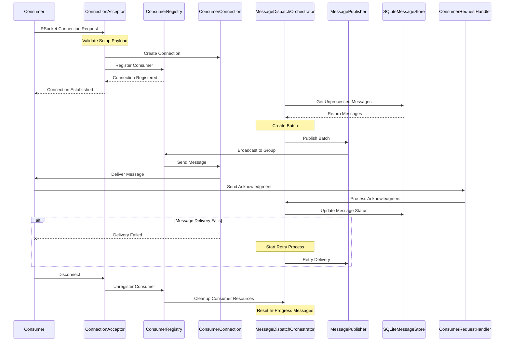

# Messaging System Consumer Architecture

## System Flow Diagram



### Flow Description

1. **Connection Phase**
    - Consumer initiates RSocket connection
    - ConnectionAcceptor validates the connection setup
    - New ConsumerConnection is created
    - Consumer is registered in ConsumerRegistry
    - Connection confirmation sent to Consumer

2. **Message Processing Phase**
    - MessageDispatchOrchestrator retrieves unprocessed messages
    - Messages are batched for efficient processing
    - MessagePublisher handles message distribution
    - ConsumerRegistry manages group-based message broadcast
    - Messages delivered to Consumer through ConsumerConnection

3. **Acknowledgment Phase**
    - Consumer sends acknowledgment via ConsumerRequestHandler
    - MessageDispatchOrchestrator processes the acknowledgment
    - Message status updated in SQLiteMessageStore

4. **Error Handling Phase**
    - Failed deliveries detected at ConsumerConnection level
    - MessageDispatchOrchestrator initiates retry process
    - MessagePublisher attempts redelivery

5. **Disconnection Phase**
    - Consumer initiates disconnect
    - ConsumerRegistry handles unregistration
    - MessageDispatchOrchestrator cleans up resources
    - In-progress messages are reset for reprocessing

## Consumer Connection Flow

1. **Connection Initialization**
- Consumer connects via RSocket protocol
- ConnectionAcceptor handles initial connection setup
- Consumer metadata is validated and connection is established
- ConsumerRegistry registers the new consumer connection

```java
// Connection setup in ConnectionAcceptor
ConsumerConnection connection = new ConsumerConnection(
    metadata,
    sendingSocket,
    messageCodec
);
consumerRegistry.registerConsumer(connection);
```

2. **Consumer Registration**
- ConsumerRegistry maintains active consumer connections
- Consumers are grouped by groupId
- Connection state is monitored for disconnections

## Message Delivery Flow

1. **Message Dispatch**
- MessageDispatchOrchestrator manages message delivery
- Messages are batched for efficient delivery
- Each batch has a unique batchId
```java
BatchMessage batchMessage = new BatchMessage(
    batchId,
    (long) messages.size(),
    messages,
    groupId
);
```

2. **Message Publishing**
- MessagePublisher handles actual message delivery
- Messages are broadcast to all consumers in a group
- Uses RSocket protocol for reliable delivery
```java
messagePublisher.publishBatchMessage(batchMessage, groupId)
    .doOnSuccess(__ -> logger.debug("Message published successfully"))
    .doOnError(error -> logger.error("Failed to publish message"));
```

3. **Acknowledgment Handling**
- Consumers send acknowledgments for received messages
- ConsumerRequestHandler processes these acknowledgments
- Message states are updated based on acknowledgments

## Batch Processing

1. **Batch Creation**
- Messages are grouped into batches for efficient processing
- Default batch size: 16 messages
- Each batch has status tracking via BatchStatus

2. **Batch Monitoring**
- Batches are monitored for timeouts
- Failed deliveries are retried
- Expired batches are cleaned up

## Error Handling

1. **Consumer Disconnection**
- Detected via RSocket connection monitoring
- Resources are cleaned up
- Messages can be requeued for delivery

2. **Message Delivery Failures**
- Retry mechanism for failed deliveries
- Batch status tracking for partial failures
- Error logging and monitoring

## Key Components

1. **ConsumerRegistry**
- Tracks active consumers
- Manages consumer groups
- Handles consumer cleanup

2. **MessageDispatchOrchestrator**
- Manages message dispatching
- Handles batch creation and monitoring
- Coordinates message delivery

3. **ConsumerConnection**
- Represents individual consumer connections
- Handles message sending to specific consumer
- Manages connection lifecycle

4. **MessagePublisher**
- Handles actual message publishing
- Manages delivery retries
- Provides delivery status tracking

## Configuration

Key configuration parameters:
```java
defaultBatchSize = 16
batchTimeoutMs = 30000
maxRetries = 3
PAYLOAD_SIZE_LIMIT = 1024 * 1024 // 1MB
```

## Monitoring

1. **Batch Status**
- Number of batches in progress
- Success/failure rates
- Processing times

2. **Consumer Status**
- Active connections
- Message throughput
- Error rates

## Best Practices

1. **Message Handling**
- Implement proper error handling
- Use appropriate batch sizes
- Monitor message sizes

2. **Consumer Implementation**
- Implement proper acknowledgment
- Handle reconnection scenarios
- Manage message processing state
