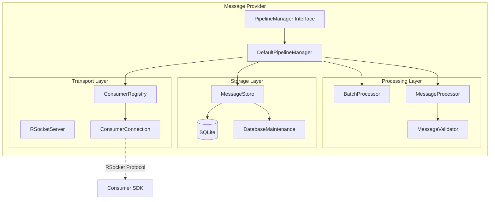
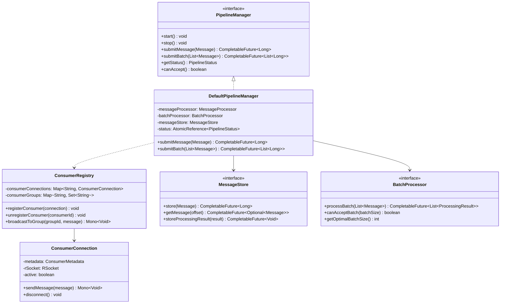
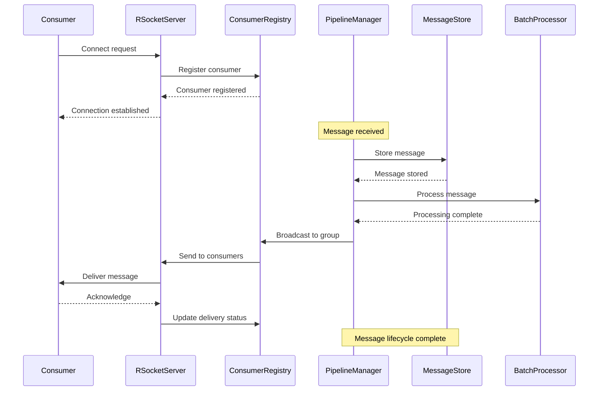

# Message Provider Service

A high-performance, scalable messaging service that supports batch processing, message persistence, and real-time message delivery using RSocket protocol.

## Architecture Overview

### Core Components

1. **Pipeline Management**
    - PipelineManager Interface
    - DefaultPipelineManager Implementation
    - Batch Processing Support
    - Message Validation

2. **Storage Layer**
    - SQLite Message Store
    - Database Maintenance
    - Message Compression
    - Performance Monitoring

3. **Transport Layer**
    - RSocket Server
    - Consumer Registry
    - Connection Management
    - Message Distribution

## Features

- Batch message processing
- Real-time message delivery
- Message persistence with SQLite
- Automatic database maintenance
- Consumer group support
- Message compression
- Performance monitoring
- Error handling and retries
- Connection management

## Technical Stack

- Java 17
- RSocket for communication
- SQLite for storage
- Reactive programming (Project Reactor)
- Micronaut framework

## Components Diagram


## Architecture Details

### Component Diagram
Shows the high-level structure and relationships between components:


### Class Diagram
Detailed class structure and relationships:



### Sequence Diagram
Shows the message flow and component interactions:


# Message Provider Service

## Key Interactions

### 1. Message Processing Flow
- Messages enter through PipelineManager
- Validated by MessageValidator
- Stored in MessageStore
- Processed by BatchProcessor if applicable
- Distributed to consumers via ConsumerRegistry

### 2. Consumer Management Flow
- Consumer connects through RSocket
- ConsumerRegistry manages registration
- ConsumerConnection handles individual connections
- Messages distributed to consumer groups
- Acknowledgments tracked and managed

### 3. Storage Management Flow
- Messages persisted to SQLite
- Regular maintenance performed
- Compression applied when beneficial
- Performance metrics collected
- Cleanup handled automatically

[Rest of the README content remains the same...]
## Getting Started

### Prerequisites
- Java 17 or higher
- Gradle 7.x or higher
- SQLite 3.x

### Configuration

```java
// Configure PipelineManager
PipelineConfig config = new PipelineConfig.Default() {
    @Override
    public int getMaxConcurrentMessages() {
        return 100;
    }

    @Override
    public int getMaxQueueSize() {
        return 1000;
    }
};

// Configure Storage
SQLiteConfig sqliteConfig = SQLiteConfig.builder()
    .dbPath("message_store.db")
    .maxMessages(10000)
    .maxStorageSize(100 * 1024 * 1024) // 100MB
    .retentionPeriodMs(24 * 60 * 60 * 1000L) // 24 hours
    .build();
```

### Usage Example

```java
// Initialize components
MessageStore messageStore = createMessageStore(dataSource, sqliteConfig);
PipelineManager pipelineManager = createPipelineManager(messageStore);
RSocketServer rSocketServer = createRSocketServer(rSocketConfig);

// Start the pipeline
pipelineManager.start();

// Submit a message
Message message = Message.builder()
    .type("TEST")
    .data("Test message content".getBytes())
    .build();

pipelineManager.submitMessage(message)
    .thenAccept(offset -> System.out.println("Message stored with offset: " + offset));
```

## Message Flow

1. Message Submission
    - Message validation
    - Storage in SQLite
    - Batch processing if applicable
    - Distribution to consumers

2. Consumer Management
    - Consumer registration
    - Group management
    - Connection monitoring
    - Message delivery

3. Storage Management
    - Automatic cleanup
    - Database maintenance
    - Performance optimization
    - Message compression

## Error Handling

The system handles various types of errors:
- Connection failures
- Storage errors
- Processing failures
- Consumer disconnections

Each error type has specific handling and retry strategies.

## Monitoring

Available metrics include:
- Message throughput
- Storage utilization
- Consumer connections
- Processing performance
- Error rates

## Scaling Considerations

The service supports scaling through:
- Batch processing
- Connection pooling
- Message compression
- Efficient storage management

## Best Practices

1. Message Processing:
    - Use appropriate batch sizes
    - Monitor processing performance
    - Handle errors properly

2. Storage Management:
    - Regular maintenance
    - Monitor disk usage
    - Set appropriate retention periods

3. Consumer Management:
    - Monitor consumer health
    - Handle disconnections gracefully
    - Implement proper error handling

## License

[Your License Here]
